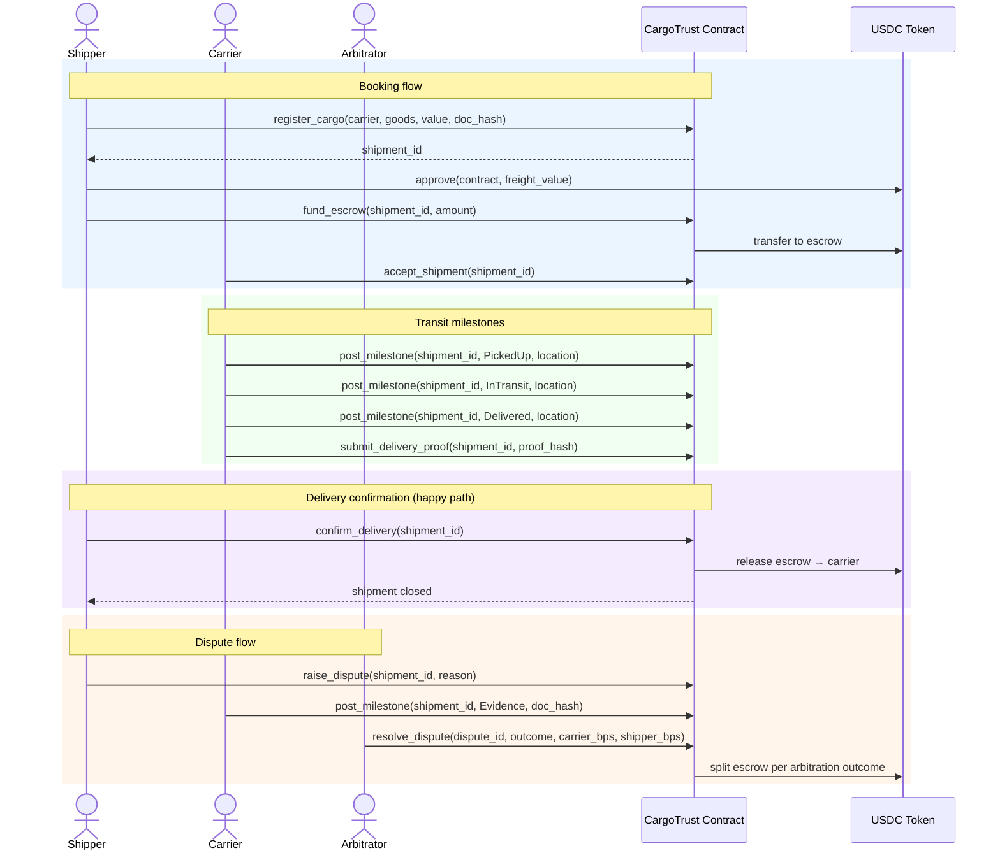

# CargoTrust

[](https://github.com/your-org/cargotrust/actions/workflows/contract-ci.yml)

Decentralized freight trust platform on Stellar — on-chain cargo registration, automated escrow release on delivery, and transparent dispute resolution for global supply chains.

## Overview

CargoTrust is a blockchain-native logistics platform that replaces paper bills of lading and fragmented freight payment flows with verifiable on-chain records. Shippers register cargo as an on-chain asset, smart contracts hold payment in escrow and release funds automatically when delivery is confirmed, and any dispute between shipper and carrier is arbitrated through an on-chain process — all with Stellar's $0.00001 fees making micro-freight economically viable.

Stellar is the backbone: near-zero transaction fees keep the platform accessible for small shippers, built-in USDC settlement eliminates FX friction, and Soroban smart contracts enforce delivery milestones, escrow logic, and dispute outcomes with auditable, tamper-proof records.

## Features

- **Cargo Registration**: Every shipment is registered as an on-chain record with goods description, origin, destination, and agreed value
- **Automated Escrow**: USDC freight payment is held in escrow and released to the carrier upon confirmed delivery — no chasing invoices
- **Milestone Tracking**: Carriers post on-chain delivery milestones (picked up, in transit, delivered); each step is an immutable log entry
- **Dispute Resolution**: Either party can raise a dispute; an appointed arbitrator adjudicates and releases or refunds escrow
- **Carrier Reputation**: On-chain completion records build a verifiable carrier reputation score over time
- **Fiat-Friendly Payments**: USDC payments settle on-chain — shippers can fund via fiat on-ramp without touching crypto
- **Passkey / Email Auth**: Users log in with Google or email; a Stellar wallet is generated silently behind the scenes
- **Multi-Party Visibility**: Consignees, customs agents, and financiers can be granted read access to shipment status in real time

## Architecture

```mermaid
graph TB
    subgraph Users
        SH[Shipper
        AR[Arbitrator]
        CN[Consignee]
    end

    subgraph Frontend["Frontend (Next.js + TailwindCSS)"]
        DASH[Shipper Dashboard]
        TRACK[Shipment Tracker]
        DISP[Dispute Portal]
        AUTH[Auth — Passkeys / Web3Auth]
    end

    subgraph Payments["Payment Layer"]
        USDC[Stellar USDC]
        ESCROW[Escrow Contract]
    end

    subgraph Contract["Smart Contracts (Soroban / Rust)"]
        REG[cargo_register.rs — Register shipment asset]
        SHIP[shipment.rs — Milestone updates & delivery confirmation]
        ESC[escrow.rs — Hold, release, or refund freight payment]
        DISP_C[dispute.rs — Raise and resolve disputes]
    end

    subgraph Storage["Off-Chain Storage"]
        IPFS[IPFS / Arweave — shipping docs & photos]
    end

    subgraph Stellar["Stellar Network"]
        LEDGER[Ledger]
        USDC_TOKEN[USDC Token Contract]
    end

    SH -->|register cargo + fund escrow| DASH
    DASH -->|store documents| IPFS
    IPFS -->|doc hash| REG
    REG -->|shipment record on-chain| LEDGER

    SH -->|deposit USDC| ESCROW
    ESCROW -->|hold funds| USDC_TOKEN

    CA -->|post milestone| TRACK
    TRACK --> SHIP
    SHIP -->|update status| LEDGER

    CA -->|confirm delivery| SHIP
    SHIP -->|trigger release| ESCROW
    ESCROW -->|pay carrier| USDC_TOKEN

    SH -->|raise dispute| DISP
    DISP --> DISP_C
    DISP_C -->|arbitration outcome| ESCROW
    ESCROW -->|release or refund| USDC_TOKEN

    AUTH -->|wallet generation| LEDGER
    AR -->|adjudicate| DISP_C
```

### Core Components

- **cargo_register.rs**: Registers a new shipment with goods description, parties, agreed freight value, and document hash
- **shipment.rs**: Handles milestone updates (pickup, in-transit, customs-cleared, delivered) and final delivery confirmation
- **escrow.rs**: Holds shipper USDC, releases to carrier on confirmed delivery, refunds shipper on failed delivery or arbitration
- **dispute.rs**: Manages dispute lifecycle — open, evidence submission, arbitration, and resolution
- **storage.rs**: Persistent on-chain storage for shipment records, escrow balances, and dispute state
- **events.rs**: Event emission for off-chain indexing (new shipments, milestones, escrow events, dispute outcomes)

### Freight Payment Model

Escrow is funded by the shipper at booking and released based on delivery outcome:

| Outcome              | Carrier Payment | Shipper Refund |
|----------------------|----------------|---------------|
| Confirmed Delivery   | 100% of escrow  | 0%            |
| Mutual Cancellation  | configurable    | configurable  |
| Arbitration — Carrier| arbitrator decision | arbitrator decision |
| Arbitration — Shipper| 0%              | 100% of escrow |

Example: A $500 USDC freight booking → $500 locked in escrow at booking → $500 released to carrier on delivery confirmation. Instant. No 30-day invoice cycle.

## Tech Stack

| Component           | Technology                          | Purpose                                                                 |
|---------------------|-------------------------------------|-------------------------------------------------------------------------|
| Smart Contracts     | Rust + Soroban (Stellar)            | Cargo registration, escrow, milestones, dispute resolution              |
| Frontend            | Next.js + TailwindCSS               | Shipper dashboard, shipment tracker, dispute portal                     |
| File Storage        | Arweave / IPFS (via Pinata)         | Shipping documents, bills of lading, delivery photos                   |
| Wallet / Auth       | Freighter Wallet / Stellar Passkeys | Blockchain auth; Web3Auth for email/Google login with silent wallet gen |
| Payment             | Stellar USDC                        | Freight escrow and settlement on-chain                                  |

## Smart Contract Functions

### Shipper Functions

- `register_cargo(shipper, carrier, consignee, goods_description, freight_value, doc_hash)` — Register a new shipment
- `fund_escrow(shipment_id, amount)` — Deposit USDC into escrow for a shipment
- `confirm_delivery(shipment_id)` — Shipper confirms goods received in good condition (triggers escrow release)
- `raise_dispute(shipment_id, reason)` — Open a dispute on a shipment

### Carrier Functions

- `accept_shipment(shipment_id)` — Carrier accepts the booking
- `post_milestone(shipment_id, status, location, doc_hash)` — Record a transit milestone on-chain
- `submit_delivery_proof(shipment_id, proof_hash)` — Submit delivery evidence (photo hash)

### Arbitrator Functions

- `resolve_dispute(dispute_id, outcome, carrier_bps, shipper_bps)` — Adjudicate a dispute and set payout split

### Admin Functions

- `initialize(admin, usdc_token, platform_fee_bps, arbitrator)` — One-time contract setup
- `update_platform_fee(fee_bps)` — Adjust platform fee percentage (admin only)
- `update_arbitrator(new_arbitrator)` — Replace the arbitrator address (admin only)
- `withdraw_fees(to)` — Withdraw accumulated platform fees (admin only)
- `pause_contract()` / `unpause_contract()` — Emergency circuit breaker (admin only)

### Query Functions

- `get_shipment(shipment_id)` — Retrieve shipment record and current status
- `get_milestones(shipment_id)` — Full milestone history for a shipment
- `get_escrow_balance(shipment_id)` — Current escrow balance
- `get_dispute(dispute_id)` — Dispute record and outcome
- `get_carrier_stats(carrier)` — Completed deliveries and reputation score
- `get_accumulated_fees()` — Platform fees available for withdrawal
- `health()` — On-chain health check

## Shipment Lifecycle — Sequence Diagram



## Shipment Lifecycle — State Machine

All shipment state is tracked by a single canonical `ShipmentStatus` enum:

```
┌──────────────┐
│  Registered  │  ← initial state (cargo registered, awaiting escrow funding)
└──────┬───────┘
       │
       ▼
┌──────────────┐
│    Funded    │  ← escrow funded by shipper
└──────┬───────┘
       │
       ▼
┌──────────────┐
│   Accepted   │  ← carrier has accepted the shipment
└──────┬───────┘
       │
       ▼
┌──────────────┐
│  InTransit   │  ← carrier posting milestones
└──────┬───────┘
       │
       ├──────────────────────┐
       │                      │
       ▼                      ▼
┌──────────────┐       ┌──────────────┐
│  Delivered   │       │  Disputed    │  ← dispute raised by either party
└──────┬───────┘       └──────┬───────┘
       │                      │
       ▼                      ▼
┌──────────────┐       ┌──────────────┐
│    Closed    │       │   Resolved   │  ← arbitrator adjudicates, escrow split
└──────────────┘       └──────────────┘
```

### Valid Transitions

| From         | To          | Trigger                                                      |
|--------------|-------------|--------------------------------------------------------------|
| Registered   | Funded      | Shipper calls `fund_escrow`                                  |
| Funded       | Accepted    | Carrier calls `accept_shipment`                              |
| Accepted     | InTransit   | Carrier calls `post_milestone` with PickedUp status          |
| InTransit    | Delivered   | Carrier calls `submit_delivery_proof`                        |
| Delivered    | Closed      | Shipper calls `confirm_delivery` — escrow released to carrier|
| InTransit    | Disputed    | Shipper or carrier calls `raise_dispute`                     |
| Delivered    | Disputed    | Shipper calls `raise_dispute` within dispute window          |
| Disputed     | Resolved    | Arbitrator calls `resolve_dispute` — escrow split            |

## Security Features

1. **Escrow Isolation**: Each shipment has its own escrow balance; funds cannot be commingled
2. **Atomic Settlement**: Escrow release and status update happen in a single transaction
3. **Authorization Checks**: All state-changing operations require proper Stellar account authorization
4. **Overflow Protection**: Safe arithmetic throughout all escrow and fee calculations
5. **Dispute Window**: Shipper has a configurable window after delivery to raise a dispute before auto-release
6. **Circuit Breaker**: Admin can pause the contract in an emergency without losing state
7. **Immutable Milestones**: Posted milestones are append-only and cannot be altered after submission

## Quick Start

### 🚀 Complete Testnet Setup (Recommended)

Get up and running with testnet XLM, USDC, and a full end-to-end shipment flow:

**Linux/macOS:**
```bash
./deploy.sh testnet
```

**Windows (PowerShell):**
```powershell
.\deploy.ps1 -Network testnet
```

This automated script will:
- Generate and fund test accounts with XLM
- Deploy the CargoTrust contract and a mock USDC token
- Register a sample shipment and run a test escrow flow
- Save all contract addresses to `.env.local`

**📖 For detailed instructions:** [QUICK_START.md](QUICK_START.md) | [DEPLOYMENT.md](DEPLOYMENT.md)

### Contract-Only Deployment

**Linux/macOS:**
```bash
chmod +x deploy.sh
./deploy.sh testnet
```

**Windows (PowerShell):**
```powershell
.\deploy.ps1 -Network testnet
```

### Manual Setup

### 1. Install Dependencies

```bash
npm install
```

### 2. Build Smart Contracts

```bash
cd contracts
cargo build --target wasm32-unknown-unknown --release
stellar contract optimize --wasm target/wasm32-unknown-unknown/release/cargotrust.wasm
```

### 3. Deploy to Testnet

```bash
stellar contract deploy \
  --wasm target/wasm32-unknown-unknown/release/cargotrust.optimized.wasm \
  --source deployer \
  --network testnet
```

### 4. Initialize Contract

```bash
stellar contract invoke \
  --id <CONTRACT_ID> \
  --source deployer \
  --network testnet \
  -- \
  initialize \
  --admin <ADMIN_ADDRESS> \
  --usdc_token <USDC_TOKEN_ADDRESS> \
  --platform_fee_bps 100 \
  --arbitrator <ARBITRATOR_ADDRESS>
```

### 5. Run the Frontend

```bash
cp .env.example .env.local
# fill in CONTRACT_ID, USDC_TOKEN_ID, etc.
npm run dev
```

See [DEPLOYMENT.md](DEPLOYMENT.md) for complete deployment instructions.

## How It Works

1. **Cargo Registration**
   - Shipper connects Freighter wallet
   - Fills in cargo details (goods, weight, origin, destination, carrier, agreed freight value)
   - Uploads shipping documents → stored on IPFS via Pinata
   - Calls `register_cargo` — shipment record created on Stellar ledger

2. **Escrow Funding**
   - Shipper approves USDC transfer and calls `fund_escrow`
   - USDC locked in contract escrow until delivery or dispute resolution
   - Carrier calls `accept_shipment` to confirm the booking

3. **Transit Milestones**
   - Carrier posts `post_milestone` at each checkpoint (pickup, customs, delivery hub)
   - Each milestone is an immutable on-chain log entry visible to all parties
   - Carrier submits delivery photo hash via `submit_delivery_proof`

4. **Delivery & Escrow Release**
   - Shipper confirms receipt via `confirm_delivery`
   - Contract atomically releases escrowed USDC to carrier (minus platform fee)
   - Carrier reputation score incremented on-chain

5. **Dispute Resolution**
   - Either party calls `raise_dispute` with a reason
   - Parties submit evidence hashes on-chain
   - Arbitrator reviews and calls `resolve_dispute` with a carrier/shipper split
   - Contract distributes escrow per arbitration outcome

6. **Admin / Fee Management**
   - Admin monitors accumulated platform fees via `get_accumulated_fees`
   - Calls `withdraw_fees` to collect platform revenue
   - Can `pause_contract` / `unpause_contract` as an emergency circuit breaker

## Environment Validation

A script checks that every env variable consumed in source code is present in the corresponding `.env.example` file. CI fails automatically if any are missing.

Run locally:

```bash
node scripts/validate-env-examples.js
```

## Configuration

CargoTrust uses environment variables for configuration across environments (local, testnet, mainnet).

### Quick Setup

1. Copy the example environment file:
   ```bash
   cp .env.example .env.local
   ```

2. Fill in your values:
   ```bash
   NEXT_PUBLIC_CONTRACT_ID=your_contract_id_here
   NEXT_PUBLIC_USDC_TOKEN=your_usdc_token_here
   NEXT_PUBLIC_NETWORK=testnet
   ```

### Key Configuration Variables

| Variable                    | Description                                      |
|-----------------------------|--------------------------------------------------|
| `NEXT_PUBLIC_CONTRACT_ID`   | Deployed CargoTrust contract address             |
| `NEXT_PUBLIC_USDC_TOKEN`    | USDC token contract address on Stellar           |
| `NEXT_PUBLIC_NETWORK`       | `testnet` or `mainnet`                           |
| `NEXT_PUBLIC_HORIZON_URL`   | Stellar Horizon endpoint                         |
| `NEXT_PUBLIC_SOROBAN_RPC`   | Soroban RPC endpoint                             |
| `PINATA_API_KEY`             | Pinata API key for IPFS document uploads         |
| `PINATA_SECRET`              | Pinata secret                                    |
| `PLATFORM_FEE_BPS`          | Platform fee in basis points (default: 100)      |
| `DISPUTE_WINDOW_LEDGERS`    | Ledgers after delivery before auto-release       |
| `NEXT_PUBLIC_API_URL`       | Backend API base URL (default: localhost:4000)   |

### Documentation

- **[DEPLOYMENT.md](DEPLOYMENT.md)**: Full deployment guide
- **[QUICK_START.md](QUICK_START.md)**: Fastest path to a running testnet instance
- **[CONTRIBUTING.md](CONTRIBUTING.md)**: Contribution guidelines

## Testing

```bash
# Smart contract tests
cd contracts && cargo test

# Frontend tests
npm run test
```

Contract test coverage includes:
- ✅ Cargo registration and metadata storage
- ✅ Escrow funding and balance tracking
- ✅ Carrier acceptance and milestone posting
- ✅ Delivery confirmation and escrow release
- ✅ Dispute opening, evidence submission, and arbitration
- ✅ Platform fee accumulation and admin withdrawal
- ✅ Authorization enforcement (shipper, carrier, arbitrator, admin roles)
- ✅ Pause / unpause circuit breaker
- ✅ Edge cases: zero escrow, double-funding, unauthorized state transitions

## MVP Scope

The initial testnet MVP focuses on a single end-to-end freight flow:

1. Shipper registers a cargo shipment and funds escrow with USDC
2. Carrier posts milestones and submits delivery proof
3. Shipper confirms delivery → escrow released to carrier instantly

Everything else (dispute portal, reputation scoring, fiat on-ramp, consignee visibility) ships in subsequent milestones.

## Roadmap

- [x] Cargo registration on Stellar testnet
- [x] Escrow funding and release on delivery confirmation
- [x] On-chain milestone tracking
- [ ] Dispute resolution with arbitrator
- [ ] Carrier reputation scoring
- [ ] Fiat on-ramp via USDC bridge
- [ ] Consignee and customs agent read access
- [ ] Mainnet launch

## Dependencies

- `soroban-sdk = "25.3.1"` — Soroban smart contract SDK
- `next = "14.2.3"` — React framework
- `@stellar/stellar-sdk = "12.1.0"` — Stellar JS SDK
- `@stellar/freighter-api = "2.0.0"` — Freighter wallet integration

## Error Codes

| Code | Error                  | Description                                    | Common Cause                         | Resolution                                          |
|------|------------------------|------------------------------------------------|--------------------------------------|-----------------------------------------------------|
| 1    | AlreadyInitialized     | Contract already initialized                   | Calling `initialize` twice           | No action needed; contract is ready                 |
| 2    | NotInitialized         | Contract not initialized                       | Operations before setup              | Admin must call `initialize` first                  |
| 3    | InvalidAmount          | Escrow amount must be > 0                      | Zero or negative freight value       | Ensure amount is a positive USDC value              |
| 4    | InvalidFeeBps          | Fee must be 0–10000 bps                        | Out-of-range fee config              | Use a value between 0 and 10000                     |
| 5    | ShipmentNotFound       | Shipment ID does not exist                     | Invalid shipment_id                  | Verify the shipment_id from transaction history     |
| 6    | NotAuthorized          | Caller is not the expected party               | Wrong account for operation          | Confirm you are using the correct Stellar account   |
| 7    | InvalidStatusTransition| Status transition not allowed                  | Out-of-order state change            | Check current status via `get_shipment`             |
| 8    | EscrowAlreadyFunded    | Escrow already funded for this shipment        | Duplicate `fund_escrow` call         | Check escrow balance; funding already complete      |
| 9    | InsufficientEscrow     | Escrow balance does not match freight value    | Partial funding attempt              | Fund full freight value in one call                 |
| 10   | DisputeNotFound        | Dispute ID does not exist                      | Invalid dispute_id                   | Verify dispute_id from `raise_dispute` response     |
| 11   | DisputeAlreadyOpen     | A dispute is already open for this shipment    | Duplicate `raise_dispute` call       | Only one active dispute allowed per shipment        |
| 12   | DisputeWindowClosed    | Dispute window has expired                     | Raising dispute after auto-release   | Contact arbitrator directly; on-chain window closed |
| 13   | ContractPaused         | Contract is paused                             | Emergency circuit breaker active     | Monitor official channels; wait for admin to unpause|
| 14   | NoFeesToWithdraw       | No accumulated platform fees                   | Withdrawal before any deliveries     | Wait for shipment completions to accumulate fees    |
| 15   | Overflow               | Arithmetic overflow in escrow/fee calc         | Extremely large USDC amount          | Use amounts within safe u128 range                  |

## Events

| Event               | Emitted When                                           |
|---------------------|--------------------------------------------------------|
| `cargo_registered`  | Shipper registers a new shipment                       |
| `escrow_funded`     | Shipper deposits USDC into escrow                      |
| `shipment_accepted` | Carrier accepts the booking                            |
| `milestone_posted`  | Carrier records a transit checkpoint                   |
| `delivery_proof`    | Carrier submits delivery evidence hash                 |
| `delivery_confirmed`| Shipper confirms receipt — escrow released to carrier  |
| `dispute_opened`    | Shipper or carrier raises a dispute                    |
| `dispute_resolved`  | Arbitrator adjudicates — escrow distributed            |
| `fees_withdrawn`    | Admin withdraws accumulated platform fees              |

## License

MIT

## Support

- GitHub Issues: [Create an issue](https://github.com/your-org/cargotrust/issues)
- Stellar Discord: https://discord.gg/stellar
- Stellar Developers: https://developers.stellar.org

## Contributing

Contributions are welcome! Please see [CONTRIBUTING.md](CONTRIBUTING.md) for guidelines.

Quick checklist:
- All contract tests pass: `cargo test`
- All frontend tests pass: `npm run test`
- New features include tests and updated documentation
- Escrow and dispute logic changes require explicit review
